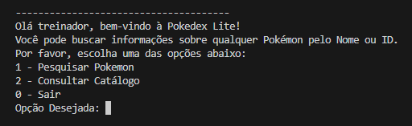
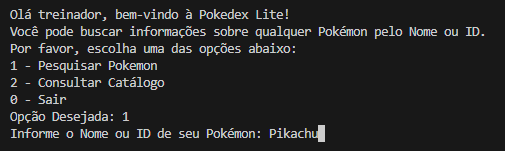
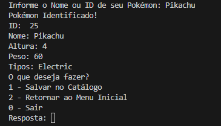
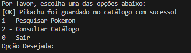
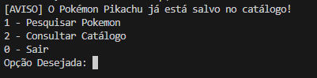
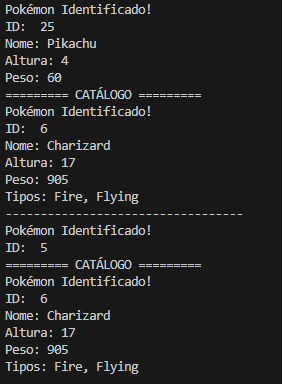

# PokedexTypeScriptLite

## Descrição do projeto

O projeto **Pokedex TypeScript Lite** é uma aplicação de terminal construída em Node.js com TypeScript. Ele funciona como uma verdadeira Pokédex: permite consultar dados de Pokémon diretamente de uma API oficial (PokeAPI) e capturá-los, salvando-os em um catálogo local em sua máquina.

## Objetivo

O objetivo desta documentação é de demonstrar de como utilizar o programa.

## Tecnologias utilizadas

- **Node.js** e **JavaScript** (Ambiente de execução)
- **TypeScript** (Tipagem forte)
- **TSX** (Execução direta de arquivos `.ts`)
- **PokeAPI** (Fornecimento dos dados)

## Pré-requisitos

Para rodar o projeto, você vai precisar das seguintes ferramentas instaladas na sua máquina:
1. **Visual Studio Code** (ou outro editor de código de sua preferência).
2. **Node.js** (O `npm` já vem incluído com ele). Você pode baixar em: [nodejs.org](https://nodejs.org/).
3. **Git** para clonar o repositório.

## Como instalar

1. Clone o repositório para a sua máquina:
```bash
git clone [https://github.com/pereirajoaoedu/PokedexTypeScriptLite.git](https://github.com/pereirajoaoedu/PokedexTypeScriptLite.git)
```

2. Entre na pasta do projeto:
```bash
cd PokedexTypeScriptLite
```

3. Instale todas as dependências do projeto:

```bash
npm install
```

## Como executar

Após os requisitos instalados, apenas execute:

```bash
npm run start
```

Se tudo der certo, você verá o terminal desta forma:



## Funcionalidades

Conforme o Menu Inicial e seus submenus:

```bash
1 - Pesquisar Pokemon
2 - Consultar Catálogo
0 - Sair
```

1. Ao acessar o menu "Pesquisar Pokémon", será solicitado informar o ID ou nome do mesmo, que após informado, caso o Pokémon seja localizado, será exibido o seguinte menu:

```bash
1 - Salvar no Catálogo
2 - Retornar ao Menu Inicial
0 - Sair
```

Escolhendo a opção 2, retornaremos ao menu inicial, mas ao clicar na opção 1, o Pokémon será salvo no arquivo `pc_box.json`, podendo ser consultado em outros momentos.

No Menu Inicial, ao escolher a opção "2 - Consultar Catálogo", temos o seguinte menu:

```bash
1 - Exibir Todos os Pokemons
2 - Deletar Pokémon do Catálogo
3 - Voltar ao Menu Inicial
0 - Sair
```

A primeira opção exibirá todos os Pokémons capturados, enquanto a segunda permitirá excluir os mesmos de acordo com o id informado.

## Exemplos de execução

1. Ao iniciar o programa, escolha a primeira opção e informe o Pokémon desejado:



2. Tecle ENTER e o Pokémon desejado será informado com seus dados e na sequência será questionado o que deseja ser feito.



3. Escolha salvar o Pokémon no Catálogo e você verá que ele foi salvo com sucesso.



4. Se pesquisar o Pikachu novamente, será retornada a mensagem de que o mesmo já existe, se tentar inserir o mesmo no catálogo novamente, repetindo os passos anteriores.



5. Vá ao menu de Consulta Catálogo e escolha a primeira opção. Serão listados todos os Pokemons.



6. Se você acessar seu arquivo pc_box.json verá os Pokémons capturados.

```javascript
[
  {
    "id": 6,
    "nome": "Charizard",
    "tipos": [
      "Fire",
      "Flying"
    ],
    "altura": 17,
    "peso": 905
  },
  {
    "id": 5,
    "nome": "Charmeleon",
    "tipos": [
      "Fire"
    ],
    "altura": 11,
    "peso": 190
  },
  {
    "id": 25,
    "nome": "Pikachu",
    "tipos": [
      "Electric"
    ],
    "altura": 4,
    "peso": 60
  }
]
```

## Explicação curta dos arquivos

1. src/main.ts: Inicia o programa, cria os serviços e os passa para o Controller (Injeção de Dependências);
2. src/controllers/TerminalController.ts: Cria o menu visual no terminal, lê as opções do usuário e procede com o fluxo;
3. src/services/PokeApiService.ts: Busca o Pokémon pelo ID ou pelo nome, diretamente na API oficial;
4. src/services/BoxService.ts: Sua única função é ler e escrever os dados no arquivo local pc_box.json;
5. src/models/CatalogoPokemon.ts: Responsável por comunicar com a BoxService.ts;
5. src/models/Pokemon.ts: Define as Interfaces e a Classe com a estrutura exata de como um Pokémon deve ser no nosso sistema;
6. src/utils/textFormatters.ts: Guarda funções simples, como a de deixar a primeira letra do nome maiúscula.

## Link do Kanban

O kanban deste projeto pode ser acessado através do link compartilhado: 
- https://trello.com/invite/b/6a88e37d69a538d5dea79bde/ATTIdc33ea94ea209b5aaffef83a6acf94e66BD731B3/projeto-pokedex-typescript-lite.

## Branches utilizadas.

1. main;
2. develop;
3. feat/pokedex;
4. docs/readme.